# sunrise-alarm
The script and schematic to build a light-based alarm from television components and a microcontroller.

This was inspired by two DIYPerks tutorials to create artificial windows from [laptop screens](https://www.youtube.com/watch?v=Y2KK4YiOO1o) and [TV displays](https://www.youtube.com/watch?v=8JrqH2oOTK4) respectively.
The backlight panels behind an LCD display make for very convincing sunlight when lit by an LED strip with a comparable color temperature. 
I decided to try to up the ante by controlling when and how bright this light shines. 
Daylight is, of course, the ideal way to wake up but is frustratingly never aligned with the time I'd like it to start. 

The script `alarm.ino` programs a controller to send a PWM signal to an N-Channel MOSFET that then dictates the brightness of light projected through the diffusion and collimation filters, in this case salvaged from an old 32" Sony. It is currently set to reach full brighness Monday though Friday at 8:45AM after a 5 minute "sunrise".

Here PW1 is a 5V regulator by [Pololu](https://www.pololu.com/product-info-merged/2843), CK1 is the precision RTC by [Adafruit](https://www.adafruit.com/product/3013), and EB1 is Arduino's Nano Every controller. The resistance of R2 and R3 is very likely overkill but I was unable to find a datasheet for the particular LED strip I purchased. Like any alarm clock there is a button to stop it once you wake. 

